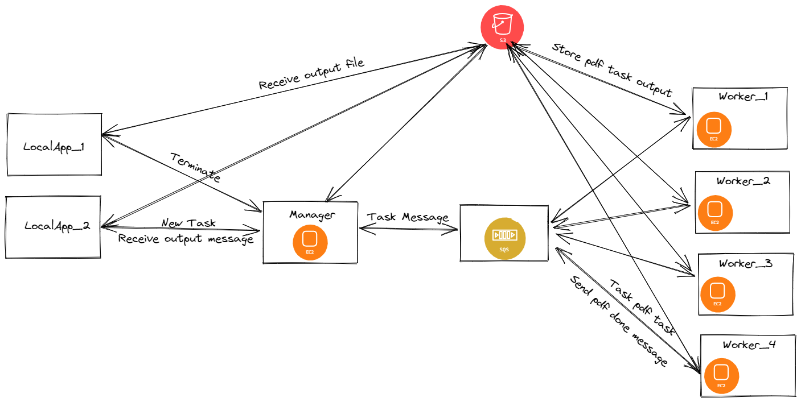

Assignment 1: PDF Document Conversion in the Cloud

Name: Andrey Palman
Id's: 320686736

How to run the sytem
cd <path>\dsp-ass1\
put your input file <path>\dsp-ass1\LocalApp\src\Input\
java -jar LocalApp <arg1> <arg2> <arg3> [<arg4> optional]
the output file will be in <path>\dsp-ass1\

Q: Did you think about scalability?
A: Yes, every Worker that the Manager "creates" is using a thread pool with a limit of the argument that the manager passes to him. so for 1b clients, the response time might be extensive, but in the end, the client will receive his output file.

Q: What about persistence
A: If a worker node dies in the middle of processing a new message or a possible communication issue. The message will return to the queue, and another worker will pick the task.

Q:  Threads in your application
A: For each new task the manager collects, he uses one thread that inits all messages to the workers. Therefore, he can take new messages from other clients.

Q: Lastly, are you sure you understand what distributed means
A: When you have a lot of work with a distributed system, you can deploy "tasks" to many workers with one instance that plays the manager rule. Instead of delegating all the work to "one" computer.

Q: Are all your workers working hard?
A: Yes. Each Worker with the limitation of his threads (thread pool) is taking tasks from the queue and working on them.

Q:  Did you manage the termination process? Be sure all is closed once requested!
A: Yes, All the tasks finished before the manager terminates all the workers.

System overview

